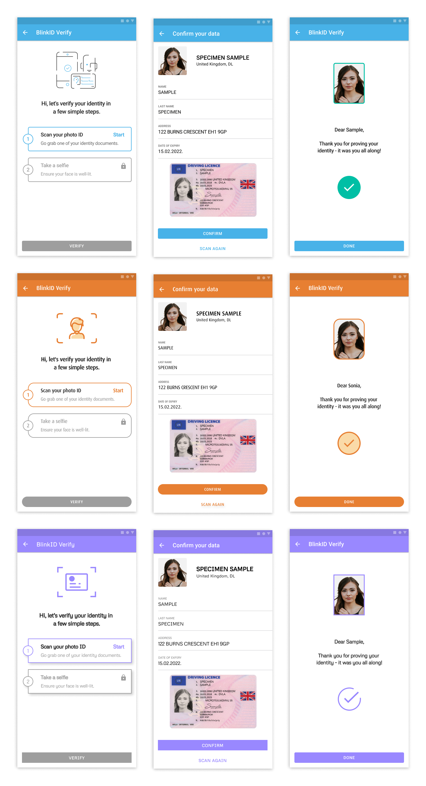
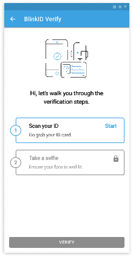
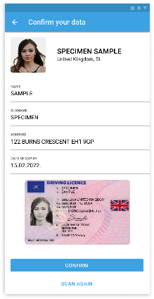
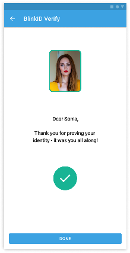

# BlinkID Verify for Android

Table of Contents
=================

   * [BlinkID Verify for Android](#blinkid-verify-for-android)
      * [Clone](#clone)
      * [Quick start with Sample apps](#quick-start-with-sample-apps)
      * [Device requirements](#device-requirements)
         * [Android version](#android-version)
         * [Camera](#camera)
         * [Processor architecture](#processor-architecture)
      * [SDK integration](#sdk-integration)
         * [Add BlinkID Verify and PhotoPay Verify library modules](#add-blinkid-verify-and-photopay-verify-library-modules)
         * [Add dependencies to build.gradle](#add-dependencies-to-buildgradle)
         * [Additional configuration](#additional-configuration)
      * [SDK workflow](#sdk-workflow)
         * [Starting the SDK](#starting-the-sdk)
         * [Retrieving information](#retrieving-information)
         * [Document filter](#document-filter)
      * [Enhanced User flow](#enhanced-user-flow)
      * [Customizing the look](#customizing-the-look)
         * [Dark mode](#dark-mode)
         * [Basic customizations](#basic-customizations)
         * [Low level customizations for each activity](#low-level-customizations-for-each-activity)
            * [MainVerifyActivity customizations](#mainverifyactivity-customizations)
            * [DocumentResultActivity customizations](#documentresultactivity-customizations)
            * [VerifyResultActivity customizations](#verifyresultactivity-customizations)
      * [Changing default strings and localization](#changing-default-strings-and-localization)
         * [Changing strings in the existing language](#changing-strings-in-the-existing-language)
         * [Adding new language](#adding-new-language)
         * [Defining strings for camera activities](#defining-strings-for-camera-activities)
            * [Document scanning strings](#document-scanning-strings)
            * [Liveness detection strings](#liveness-detection-strings)
      * [API documentation](#api-documentation)


## Clone

- Since the libraries are stored on [Git Large File Storage](https://git-lfs.github.com), you need to [install git-lfs](https://docs.github.com/en/github/managing-large-files/installing-git-large-file-storage).

- **Be sure to restart your console after installing Git LFS**.

- Clone this git repository.


## Quick start with Sample apps

Check the [**BlinkIDVerify**](https://github.com/BlinkID/blinkid-verify-android/tree/master/BlinkIDVerify) Android Studio project with sample apps.

It contains following sample apps:

- **Kotlin** `sample-app` with detailed instructions for using the **BlinkID Verify SDK**.
- **Java** `sample-java-app` is the simplest possible example. For more detailed instructions, see `sample-app` written in Kotlin.

## Device requirements

### Android version

*BlinkID Verify* requires **Android 4.1** (API level **16**) or newer. For best performance and compatibility, we recommend at least Android 5.0.

### Camera

Camera with autofocus is required. In order to perform successful scans, camera preview resolution must be at least 480p.

### Processor architecture

*BlinkID Verify* works on devices with **ARMv7**, **ARM64**, **x86** or **x86_64** processor.

## SDK integration

BlinkID Verify SDK is distributed as `.aar` library, you can find `blinkid-verify-lib.aar` [here](https://github.com/BlinkID/blinkid-verify-android/blob/master/BlinkIDVerify/blinkid-verify-lib/blinkid-verify-lib.aar), inside [BlinkIDVerify](https://github.com/BlinkID/blinkid-verify-android/tree/master/BlinkIDVerify) Android Studio project. 

Here are complete list of BlinkID Verify SDK dependencies which also have to be included in the project:

 - **PhotoPay Verify SDK** - you can find `LibPhotoPay.aar` [here](https://github.com/BlinkID/blinkid-verify-android/blob/master/BlinkIDVerify/LibPhotoPay/LibPhotoPay.aar), inside [BlinkIDVerify](https://github.com/BlinkID/blinkid-verify-android/tree/master/BlinkIDVerify) Android Studio project.
 - `org.jetbrains.kotlin:kotlin-stdlib:1.4.0`
 - `androidx.core:core-ktx:1.3.1`
 - `androidx.appcompat:appcompat:1.2.0`
 - `com.google.android.material:material:1.2.1`
 - `androidx.constraintlayout:constraintlayout:2.0.1`
 - `org.jetbrains.kotlinx:kotlinx-coroutines-core:1.3.9`
 - `org.jetbrains.kotlinx:kotlinx-coroutines-android:1.3.9`
 - `com.squareup.okhttp3:okhttp:3.14.9`

#### Add BlinkID Verify and PhotoPay Verify library modules

1. In Android Studio menu, click *File*, select *New* and then select *Module*.
2. In new window, select *Import .JAR or .AAR Package*, and click *Next*.
3. In *File name* field, enter the path to **blinkid-verify-lib.aar** and click *Finish*. 

Repeat the same steps for [`LibPhotoPay.aar`](https://github.com/BlinkID/blinkid-verify-android/blob/master/BlinkIDVerify/LibPhotoPay).

#### Add dependencies to `build.gradle`

```
dependencies {
    // blinkid-verify-lib and LibPhotoPay modules added in previous step:
    implementation project(':blinkid-verify-lib')
    implementation project(':LibPhotoPay')
    // additional blinkid-verify-lib dependencies:
    implementation 'org.jetbrains.kotlin:kotlin-stdlib:1.4.0'
    implementation 'androidx.core:core-ktx:1.3.1'
    implementation 'androidx.appcompat:appcompat:1.2.0'
    implementation 'com.google.android.material:material:1.2.1'
    implementation 'androidx.constraintlayout:constraintlayout:2.0.1'
    implementation 'org.jetbrains.kotlinx:kotlinx-coroutines-core:1.3.9'
    implementation 'org.jetbrains.kotlinx:kotlinx-coroutines-android:1.3.9'
    implementation 'com.squareup.okhttp3:okhttp:3.14.9'
}
```

#### Additional configuration

 - Add following compiler options in the application level `build.gradle`:
	
```
...
android {
    ...
    compileOptions {
        sourceCompatibility JavaVersion.VERSION_1_8
        targetCompatibility JavaVersion.VERSION_1_8
    }
}
```

 - [Enable MultiDex](https://developer.android.com/studio/build/multidex)

 
## SDK workflow	

### Starting the SDK 

To start the SDK, call `VerifySDK.startVerification` method with the prepared configuration:

```kotlin
VerifySDK.startVerification(this, createVerifyConfiguration())
```

Configuration example:

```kotlin
private fun createVerifyConfiguration(): VerifyConfiguration {
    // license file from assets folder
    val microblinkLicense = MicroblinkLicenseFile("com.microblink.blinkid.verify.dev.sample.mblic")
    
    return VerifyConfiguration.Builder(microblinkLicense, verificationFinishListener)
        // URL to verification service which verifies the scanned data (performs face matching,
        // and verifies digital signatures of scanned data).
        .verificationServiceUrl("https://blinkid-verify-ws.microblink.com/verification")     
        // Verification steps - only combination of DocumentScanStep and LivenessCheckStep is allowed for now.
        .verificationSteps(
            BlinkIdScanStep.Builder()
                // array of DocumentFields that will be shown in the result screen and returned
                // via documentResultListener
                .documentFields(buildDocumentFields())
                // whether to show full document images in result screen and return them in results
                .showDocumentImages(true)
                // listener for the document scanning results
                .documentResultListener(documentResultListener)
                // document filter, if not set, all supported documents will be allowed
                .documentFilter(CustomDocumentFilter())
                .build(),
            LivenessCheckStep.Builder("<your_liveness_license_key>")
                // listener for the liveness detection result
                .livenessResultListener(livenessResultListener)
                .build()
        )
        .build()
}
```

### Retrieving information

Verification results are returned via following listeners:

`DocumentResultListener`

```kotlin
val documentResultListener = object : DocumentResultListener {
    override fun onResultConfirmed(
        // result of document scanning and possible user modifications on scanned data
        result: DocumentResult,
        // Handler which can be used to temporary pause the verification process and return
        // control from the verify SDK, and later resume or cancel the verification process.
        flowHandler: VerificationFlowHandler
    ) {
        // invoked after the user has confirmed (and maybe modified) the document scanning result
        // FieldType -> ResultField map of all result fields
        val resultFieldsMap = result.getResultFieldsAsMap()
        // do somethind with the results
    }
}
```

`LivenessResultListener`

```kotlin
val livenessResultListener = object : LivenessResultListener {

    // Called when the liveness check fails, which means that liveness detection
    // has not proved that the live person is interacting with the device.
    override fun onLivenessCheckFailed() {
    }

    override fun onLivenessCheckSuccess(
        result: LivenessResult,
        flowHandler: VerificationFlowHandler
    ) {
        val faceImage = result.faceImage
        // do something with the selfie face image
    }
}
```

When vefification is finished, `VerificationFinishListener` listener will be notified:

```kotlin
// Listener whose callbacks are invoked when verification is
// finished and control is returned from the verify SDK.

val verificationFinishListener = object: VerificationFinishListener {
    override fun onVerificationCanceled() {
        // Called when verification has been canceled by user or the process is killed by the operating system.
    }

    override fun onVerificationFailed() {
        // Called after verification has failed.
    }

    override fun onVerificationSuccess() {
        // Called after verification has been completed successfully.
    }
}
```

### Document filter

It is possible to allow or not allow scanning of specific documents, filtered by country, region and type.

Custom `DocumentFilter` should be implemented like this:

```kotlin
@Parcelize
class CustomDocumentFilter: DocumentFilter {
    /**
     * Called while scanning document, after the document is detected to determine whether the
     * document should be processed or not, based on the detected country, region and type of
     * the scanned document.
     */
    override fun isDocumentAllowed(country: Country, region: Region, type: Type): Boolean {
        // this filter allows only documents from the USA
        if (country == Country.USA) {
            return true
        }
        return false
    }
}
```

## Enhanced User flow

User flow is the path taken by a user in an app to complete a task. This path can be represented as a sequence of the user’s actions. Our new clutter-free screens with clear visual hierarchy lead users through the whole process. In our new user flow, user is fully immersed in what they are doing and the task they aim to accomplish.

## Customizing the look

It is not possible to move elements of the UI around, remove parts of the UI, or add new parts. If this is important to you, you should consider using the PhotoPay Verify SDK directly to build your own UI and scanning logic.

The BlinkID Verify SDK comes with the ability to customize some aspects of the UI by using the UI theming. The screens can be customized to fit your app’s look and feel by defining themes in your application that override themes from the SDK. Each theme must extend the corresponding base theme from the SDK, as described in the following sections.

See the following screenshots to get the general insight into possible customizations.



### Dark mode

SDK supports dark mode by default, all SDK themes extend `Theme.MaterialComponents.DayNight` theme.

[Here](https://developer.android.com/guide/topics/ui/look-and-feel/darktheme#changing_themes_in-app) you can find instructions how to control dark and light mode in your app.

### Basic customizations

To customize common UI properties used on all screens, define `MBVerifyTheme`, which must extend `MBVerifyBaseTheme`:

```
<style name="MBVerifyTheme" parent="MBVerifyBaseTheme">
    <!--Override properties from the MBVerifyBaseTheme-->

	<!-- Applied to App bar (Toolbar) background -->
    <item name="colorPrimary">@color/your_color_primary</item>
    <!-- Applied to status bar -->
    <item name="colorPrimaryDark">@color/your_color_primary_dark</item>
    <!-- Applied to progress bar -->
    <item name="colorAccent">@color/your_color_accent</item>

    <item name="mbVerifyPrimaryColor">@color/your_verify_color_primary</item>
    <item name="mbVerifyBackgroundColor">@color/your_verify_background_color</item>
    <item name="mbVerifySuccessColor">@color/your_verify_success_color</item>
    <item name="mbVerifyErrorColor">@color/your_verify_error_color</item>
    <item name="mbVerifyFilledButtonBackgroundColor">@color/your_verify_button_background_color</item>
    <item name="mbVerifyFilledButtonTextColor">@color/your_verify_button_text_color</item>
    
    <item name="mbVerifyFontRegular">@font/your_regular_font</item>
    <item name="mbVerifyFontMedium">@font/your_medium_font</item>

    <!-- ... there are more properties available -->
</style>
```

For a complete list of all properties that are available for overriding, see `MBVerifyBaseTheme`. 

### Low level customizations for each activity

Additionally, you can customize specific UI elements on each activity by defining activity themes.

#### MainVerifyActivity customizations



Define `MBVerifyMainScreenTheme`, which must extend `MBVerifyTheme.MainScreenBase`:

```
<style name="MBVerifyMainScreenTheme" parent="MBVerifyTheme.MainScreenBase">
    <!--Override properties from the MBVerifyTheme.MainScreenBase-->

    <item name="mbVerifyMainIllustrationDrawable">@drawable/your_main_illustration</item>
    <item name="mbVerifyTextAppearanceMainScreenMessage">@style/your_text_appearance_main_message</item>-->
    <item name="mbVerifyStepElevation">@dimen/your_step_elevation</item>

    <!-- ... there are more properties available -->
</style>
```
For a complete list of all properties that are available for overriding, see `MBVerifyTheme.MainScreenBase`. 

#### DocumentResultActivity customizations



Define `MBVerifyDocumentResultsScreenTheme`, which must extend `MBVerifyTheme.DocumentResultsScreenBase`:

```
<style name="MBVerifyDocumentResultsScreenTheme" parent="MBVerifyTheme.DocumentResultsScreenBase">
    <!--Override properties from the MBVerifyTheme.DocumentResultsScreenBase-->

    <item name="mbVerifyDocumentResultsTooltipBackgroundColor">@color/your_tooltip_background_color</item>
    <item name="mbVerifyDocumentResultsIconTooltipDrawable">@drawable/your_tooltip_drawable</item>

    <!-- ... there are more properties available -->
</style>
```
For a complete list of all properties that are available for overriding, see `MBVerifyTheme.DocumentResultsScreenBase`.

#### VerifyResultActivity customizations



Define `MBVerifyVerificationScreenTheme `, which must extend `MBVerifyTheme.VerificationScreenBase`:

```
<style name="MBVerifyVerificationScreenTheme" parent="MBVerifyTheme.VerificationScreenBase">
    <!--Override properties from the MBVerifyTheme.VerificationScreenBase-->

    <item name="mbVerifyResultsIconFailDrawable">@drawable/your_icon_fail</item>
    <item name="mbVerifyResultsIconSuccessDrawable">@drawable/your_icon_success</item>

    <!-- ... there are more properties available -->
</style>
```
For a complete list of all properties that are available for overriding, see `MBVerifyTheme.VerificationScreenBase`.


## Changing default strings and localization

SDK is localized to following languages:

 - English(default)
 - Croatian

You can modify those strings and add your own language.

### Changing strings in the existing language
	
To modify an existing string, the best approach would be to:

1. Choose a language you want to modify. For example Croatian ('hr').
2. Find `strings.xml` in folder `res/values-hr` of the `blinkid-verify-lib.aar` archive.
3. Choose a string key which you want to change. For example: `<string name="mb_verify_btn_confirm">Confirm</string>`.
4. In your project create a file `strings.xml` in the folder `res/values-hr`, if it doesn't already exist.
5. Create an entry in the file with the value for the string. For example: `<string name="mb_verify_btn_confirm">Potvrdi</string>`.
6. Repeat for all the string you wish to change.

### Adding new language

SDK can easily be translated to other languages. The `res` folder in `blinkid-verify-lib.aar` archive has folder `values` which contains `strings.xml` - this file contains English strings. In order to make e.g. German translation, create a folder `res/values-de` in your project and put the copy of `strings.xml` inside it (you might need to extract `blinkid-verify-lib.aar` archive to access those files). Then, open that file and translate the strings from English into German.

### Defining strings for camera activities

#### Document scanning strings

To change strings used on the document scanning camera screen, you can set the `DocumentScanStrings` when creating `BlinkIdScanStep`:

```kotlin
BlinkIdScanStep.Builder()
    .documentScanStrings(
        DocumentScanStrings.Builder()
            .firstSideInstructionsText(R.string.your_first_side_instructions)
            // ... there are other strings available
            .build()
    )
    .build()
```

#### Liveness detection strings

To change strings used on the liveness detection camera screen, you can set the `LivenessCheckStrings` when creating `LivenessCheckStep`:

```kotlin
LivenessCheckStep.Builder("<License_key>")
    .livenessCheckStrings(
        LivenessCheckStrings.Builder()
            .actionSmile(R.string.your_string_for_smile_action)
            // ... there are other strings available
            .build()
    )
    .build()
```

## API documentation

You can find BlinkID Verify *KDoc* documentation [here](https://github.com/BlinkID/blinkid-verify-android/tree/master/docs).