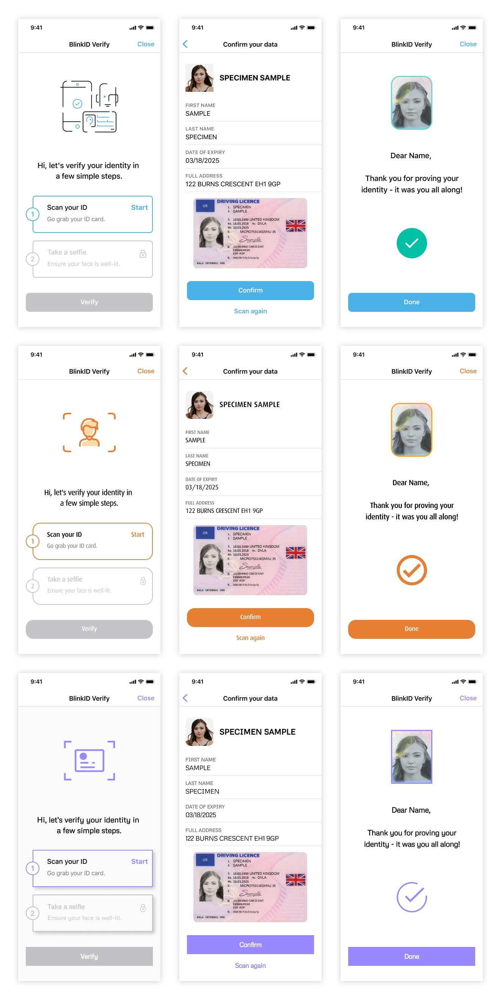

<p align="center" alt="Microblink Logo"></p>

# BlinkID Verify for iOS

## Table of Contents

   * [BlinkID Verify for iOS](#blinkid-verify-for-ios)
      * [Clone](#clone)
      * [Verify &amp; PhotoPay](#verify--photopay)
      * [Sample app](#sample-app)
      * [Quick Start](#quick-start)
      * [Enhanced User flow](#enhanced-user-flow)
      * [Customization](#customization)
         * [Localization](#localization)
         * [BlinkID Localization](#blinkid-localization)
         * [Colors](#colors)
         * [Images](#images)
         * [Fonts](#fonts)
         * [Corner radius](#corner-radius)
         * [Shadows](#shadows)
      * [Date Formatter](#date-formatter)
      * [Documents Filters](#documents-filters)
      * [Results Screen Document Fields](#results-screen-document-fields)

## Clone

Clone this git repository.

Install Git Large File Storage by running these commands:
```shell
brew install git-lfs
git lfs install
```

**Be sure to restart your console after installing Git LFS.**

## PhotoPay Verify

:warning: If you need to use BlinkID Verify with PhotoPay, please checkout and use frameworks from [photopay-verify-ios](https://github.com/BlinkID/blinkid-verify-ios/tree/photopay-verify-ios) branch.

## Sample app

Check the **BlinkIDVerifySample** project.

It is shown how to use **BlinkID Verify** in both Swift & Objective-C.

## Quick Start

Drag and drop **Microblink.xcframework** and **BlinkIDVerifyFramework.xcframework** to your project.

Since frameworks are a dynamic framework, you also need to add it to the embedded binaries section in the General tab of your target, and for **both** choose option **Embed & Sign**.

Include the additional frameworks and libraries into your project in the "Linked frameworks and libraries" section of your target settings.

- AudioToolbox.framework
- AVFoundation.framework
- CoreMedia.framework
- libc++.tbd
- libiconv.tbd
- libz.tbd

In Info.plist add key `NSCameraUsageDescription` key.

**Swift Integration**

In your ViewController import BlinkID Verify framework.

```swift
import BlinkIDVerifyFramework
```
In your ViewController conform to delegate and add delegate methods.

```swift
extension ViewController: MBBlinkIDVerifyDelegate {
    
    func verifyDidFinishSuccessfulVerification(_ verifyViewController: UIViewController, verifyItem: MBVerifyItem) {
        // Do something with data from verifyItem
        verifyViewController.dismiss(animated: true, completion: nil)
    }
    
    func verifyDidClose(_ verifyViewController: UIViewController) {
        verifyViewController.dismiss(animated: true, completion: nil)
    }
    
}
```

Add function for showing BlinkID Verify.
```swift
func showBlinkIDVerify() {
    // Get you Microblink Demo License on developer portal: https://microblink.com/customer/dashboard
    let microblinkLicense = ""
    // Contact us for Visage License
    let visageLicense = ""
     
    // Set base url of your backend
    let baseURL = "https://yourdomain.com"
    // Set path endpoint of your backend
    let verificationEndpoint = "/yourendpoint"
     
    let apiSettings = MBVerifyAPISettings(baseURL: baseURL, verificationEndpoint: verificationEndpoint)
     
    let configurator = MBBlinkIDVerifyConfigurator(microblinkLicense: microblinkLicense, visageLicense: visageLicense, apiSettings: apiSettings)

    // Initialize MBBlinkIDVerify
    let verify = MBBlinkIDVerify(configurator: configurator, delegate: self)
    let viewController = verify.getInitialViewController()
    self.present(viewController, animated: true, completion: nil)
}
```
**Objective-C Integration**

In your ViewController import BlinkID Verify framework.

```objective-c
#import <BlinkIDVerifyFramework/BlinkIDVerifyFramework.h>
```

In your ViewController conform to delegate.
```objective-c
@interface YourViewController () <MBBlinkIDVerifyDelegate>
```

Add delegate methods:
```objective-c
- (void)verifyDidFinishSuccessfulVerification:(nonnull UIViewController *)verifyViewController verifyItem:(nonnull MBVerifyItem *)verifyItem {
    // Do something with data from verifyItem
    [verifyViewController dismissViewControllerAnimated:YES completion:nil];
}

- (void)verifyDidClose:(nonnull UIViewController *)verifyViewController {
    [verifyViewController dismissViewControllerAnimated:YES completion:nil];
}
```

Add function for showing BlinkID Verify.
```objective-c
- (void)showBlinkIDVerify {
    // Get you Microblink Demo License on developer portal: https://microblink.com/customer/dashboard
    NSString *microblinkLicense = @"";
    // Contact us for Visage License
    NSString *visageLicense = visageLicense = @"";

    // Set base url of your backend
    NSString *baseURL = @"https://yourdomain.com";
    // Set path endpoint of your backend
    NSString *verificationEndpoint = @"/yourendpoint";
    
    MBVerifyAPISettings *apiSettings = [[MBVerifyAPISettings alloc] initWithBaseURL:baseURL verificationEndpoint:verificationEndpoint];
    
    MBBlinkIDVerifyConfigurator *configurator = [[MBBlinkIDVerifyConfigurator alloc] initWithMicroblinkLicense:microblinkLicense visageLicense:visageLicense apiSettings:apiSettings];

    // Initialize MBBlinkIDVerify
    MBBlinkIDVerify *verify = [[MBBlinkIDVerify alloc] initWithConfigurator:configurator delegate:self];
    UIViewController *viewController = [verify getInitialViewController];
    [self presentViewController:viewController animated:YES completion:nil];
}
```

## Enhanced User flow

User flow is the path taken by a user in an app to complete a task. This path can be represented as a sequence of the user’s actions. Our new clutter-free screens with clear visual hierarchy lead users through the whole process. In our new user flow user is fully immersed in what they are doing and the task they aim to accomplish.

## Customization

It is not possible to move elements of the UI around, remove parts of the UI, or add new parts. If this is important to you, you should consider using the [BlinkID SDK](https://github.com/BlinkID/blinkid-ios) directly to build your UI and scanning logic.

The BlinkID Verify SDK comes with the ability to customize some aspects of the UI by using the UI theming. The screens can be customized to fit your app’s look and feel by defining themes in your application that override themes from the SDK. Each theme must extend the corresponding base theme from the SDK, as described in the following sections.

See the following screenshots to get the general insight into possible customizations.

<p align="center" alt="UI Customization Screenshots"></p>

### Localization

BlinkID is currently localized in English and Croatian. In the [English localization strings](localization-strings/localization-strings-en.txt) and [Croatian localization strings](localization-strings/localization-strings-hr.txt) files, you can see all used strings.
To change strings in SDK, create your localized strings file, and  in the right column in Xcode press the button **Localize.** In that newly created file override the key for a string that you want to change. 
Example:
```
"mbidverify_verify_title" = "Verify";
```
**For localization to take effect you need to specify the localization file name.**

**Swift:**
```swift
MBVerifyLocalizationTheme.shared().localizationFileName = "YourLocalizedFileName"
```
**Objective-C:**
```objective-c
[MBVerifyLocalizationTheme sharedInstance].localizationFileName = @"YourLocalizedFileName";
```

### BlinkID Localization

**BlinkID Verify** is using **BlinkID** framework. Strings on document scanning and liveness screen can be found directly in framework. You can find English strings [here](Microblink.xcframework/ios-armv7_arm64/Microblink.framework/en.strings).

### Colors
You can specific colors in SDK like this:

**Swift:**
```swift
if #available(iOS 13.0, *) {
    MBVerifyColorTheme.shared().primaryColor = UIColor { traits -> UIColor in
        if traits.userInterfaceStyle == .light {
            return UIColor(red: 0.282, green: 0.698, blue: 0.91, alpha: 1)
        } else {
            return UIColor(red: 0.282, green: 0.698, blue: 0.91, alpha: 1)
        }
    }
} else {
    MBVerifyColorTheme.shared().primaryColor = UIColor(red: 0.282, green: 0.698, blue: 0.91, alpha: 1)
}
```
**Objective-C:**
```objective-c
if (@available(iOS 13.0, *)) {
    self.primaryColor = [UIColor colorWithDynamicProvider:^UIColor * _Nonnull(UITraitCollection * _Nonnull traits) {
        if (traits.userInterfaceStyle == UIUserInterfaceStyleLight) {
            return [UIColor colorWithRed:0.282 green:0.698 blue:0.91 alpha:1.0];
        } else {
            return [UIColor colorWithRed:0.282 green:0.698 blue:0.91 alpha:1.0];
        }
    }];
} else {
    self.primaryColor = [UIColor colorWithRed:0.282 green:0.698 blue:0.91 alpha:1.0];
}
```
### Images

Images can be changed.

**Swift:**
```swift
MBVerifyImageTheme.shared().illustrationBackground = UIImage(named: "MyCustomImage")
```
**Objective-C:**
```objective-c
[MBVerifyImageTheme sharedInstance].illustrationBackground = [UIImage imageNamed:@"MyCustomImage"];
```
### Fonts
It is possible to change the entire font family or only specific fonts.

**Swift:**
```swift
MBVerifyFontTheme.shared().setupCustomFontFamily("Gotham")
MBVerifyFontTheme.shared().titleFont = UIFont.boldSystemFont(ofSize: 22)
```
**Objective-C:**
```objective-c
[[MBVerifyFontTheme sharedInstance] setupCustomFontFamily:@"Didot"];
[MBVerifyFontTheme sharedInstance].titleFont = [UIFont boldSystemFontOfSize:22];
```
### Corner radius

Corner radius can be changed for actions, step circle in actions, buttons, and document photo.

**Swift:**
```swift
MBVerifyViewTheme.shared().buttonCornerRadius = 6
```
**Objective-C:**
```objective-c
[MBVerifyViewTheme sharedInstance].buttonCornerRadius = 6;
```

### Shadows

Shadows can be added for actions/steps. What can be customized is: shadow color, shadow offset, shadow opacity, and shadow radius.

**Swift:**
```swift
MBVerifyViewTheme.shared().stepViewShadowColor = .black
```
**Objective-C:**
```objective-c
[MBVerifyViewTheme sharedInstance].stepViewShadowColor = [UIColor blackColor];
```

## Date Formatter

Custom date format can be specified for the Results screen. 

**Swift:**
```swift
MBVerifyDateFormatterTheme.shared().customDateFormat = "dd.MM.yyyy."
```
**Objective-C:**
```objective-c
[MBVerifyDateFormatterTheme sharedInstance].customDateFormat = @"dd.MM.yyyy.";
```

**Swift:**
```swift
MBVerifyViewTheme.shared().stepViewShadowColor = .black
```
**Objective-C:**
```objective-c
[MBVerifyViewTheme sharedInstance].stepViewShadowColor = [UIColor blackColor];
```

## Documents Filters

It is possible to allow or not allow scanning specific documents filtered by country, region, and type.

`MBBlinkIDVerifyConfigurator` described in [Swift integration](#Swift-Integration) and [Objective-C integration](#Objective-C-Integration), should be updated with this:

**Swift:**

```swift
// Defining filter for specific countries
let documentCountries = [MBBlinkIDVerifyDocumentCountry(country: .slovenia),
                         MBBlinkIDVerifyDocumentCountry(country: .croatia)]

// Defining filter for specific regions
let documentRegions = [MBBlinkIDVerifyDocumentRegion(region: .none)]

// Defining filter for specific document types
let documentTypes = [MBBlinkIDVerifyDocumentType(type: .typeId)]

// allowScanning is here to define if you  want to allow scanning documents for defined countries, regions and types or you will not allow
let documentFilter = MBBlinkIDVerifyDocumentFilter(documentCountries: documentCountries, documentRegions: documentRegions, documentTypes: documentTypes, allowScanning: true)

// Final step is to assign property to MBBlinkIDVerifyConfigurator
configurator.documentFilter = documentFilter
```

**Objective-C:**

```objective-c
// Defining filter for specific countries
NSArray *documentCountries = @[
	[[MBBlinkIDVerifyDocumentCountry alloc] initWithCountry:MBCountryUsa],
	[[MBBlinkIDVerifyDocumentCountry alloc] initWithCountry:MBCountryCroatia]
];

// Defining filter for specific regions
NSArray *documentRegions = @[
	[[MBBlinkIDVerifyDocumentRegion alloc] initWithRegion:MBRegionNone]
];

// Defining filter for specific document types
NSArray *documentTypes = @[
	[[MBBlinkIDVerifyDocumentType alloc] initWithType:MBTypeId]
];

// allowScanning is here to define if you  want to allow scanning documents for defined countries, regions and types or you will not allow
MBBlinkIDVerifyDocumentFilter *documentFilter = [[MBBlinkIDVerifyDocumentFilter alloc] initWithDocumentCountries:documentCountries documentRegions:documentRegions documentTypes:documentTypes allowScanning:YES];

// Final step is to assign property to MBBlinkIDVerifyConfigurator
configurator.documentFilter = documentFilter;
```

## Results Screen Document Fields

It is possible to display specific fields on the Results screen with defined properties:
- fieldType: type of field
- insertable: field is mandatory, it will be inserted if it doesn’t exist on a document
- editable: user can edit read data
-  **insertable and editable are ignored for date types. They can’t be edited.**
- validationBlock: optional validation for each field (example in Sample)
- keyboardType: type of keyboard that will be displayed on editing specific field.

`MBBlinkIDVerifyConfigurator` described in [Swift integration](#Swift-Integration) and [Objective-C integration](#Objective-C-Integration), should be updated with this:

**Swift:**

```swift
let firstName = MBIDField(fieldType: .firstName, insertable: true, editable: true, validationBlock: nil, keyboardType: .default)
let personalId = MBIDField(fieldType: .personalIdNumber, insertable: true, editable: true, validationBlock: { value -> Bool in
	return self.isIdValid(value: value)
}, keyboardType: .numberPad)

configurator.documentFields = MBDocumentFields(idFields: [firstName, personalId])

// Example of custom validation

private func isIdValid(value: Any) -> Bool {
    if let stringValue = value as? String, stringValue.count == 11, let _ = Int(stringValue) {
		return true
	}
	return false
}
```

**Objective-C:**

```objective-c
MBIDField *firstName = [[MBIDField alloc] initWithFieldType:MBIDFieldTypeFirstName insertable:YES editable:YES validationBlock:nil keyboardType:UIKeyboardTypeDefault];
MBIDField *personalIdNumber = [[MBIDField alloc] initWithFieldType:MBIDFieldTypePersonalIdNumber insertable:YES editable:YES validationBlock:^BOOL(NSString *value) {
	return [self isPersonalIDValid:value];
} keyboardType:UIKeyboardTypeDefault];

MBDocumentFields *documentFields = [[MBDocumentFields alloc] initWithIDFields:@[firstName, personalIdNumber]];

configurator.documentFields = documentFields;

// Example of custom validation

- (BOOL)isPersonalIDValid:(NSString *)value {
    if ([value length] == 11) {
        return YES;
    }
    return NO;
}

```
